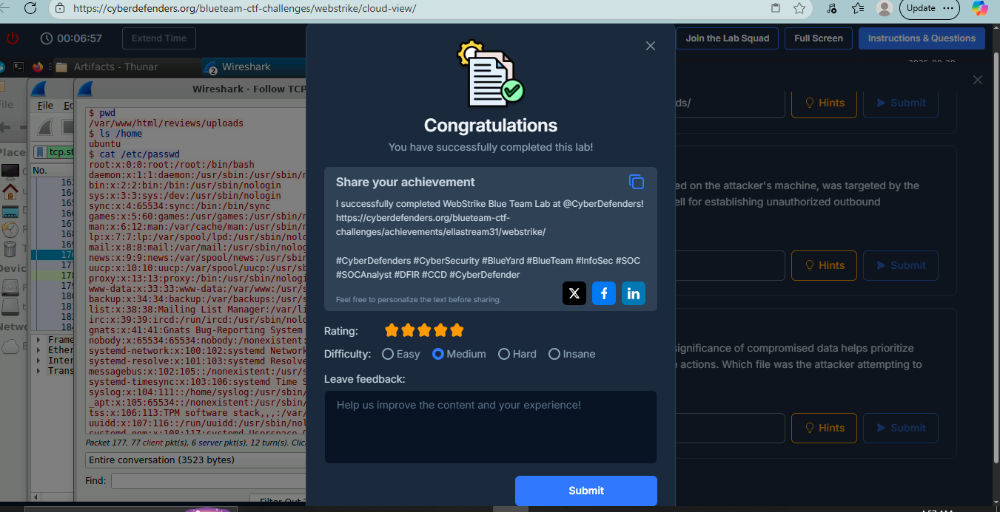
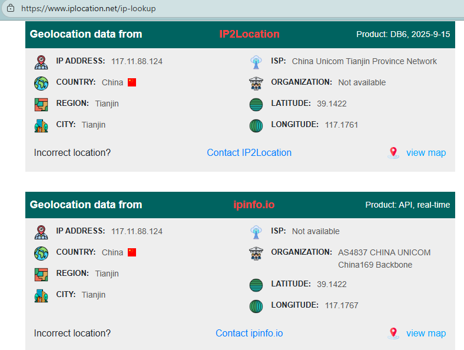
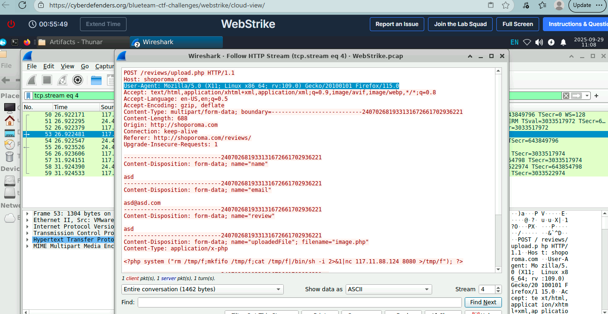
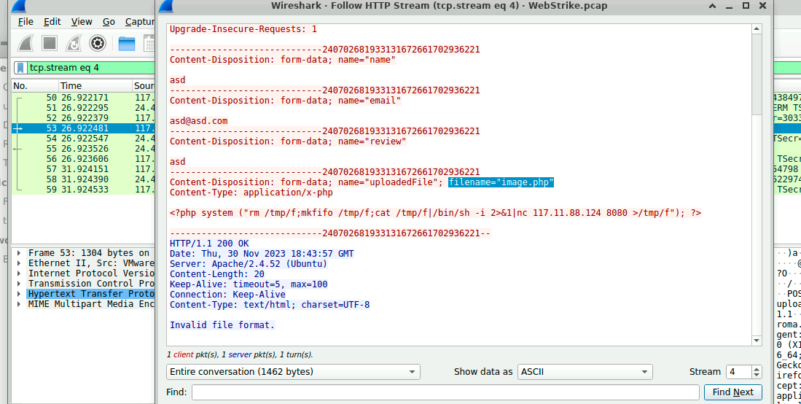
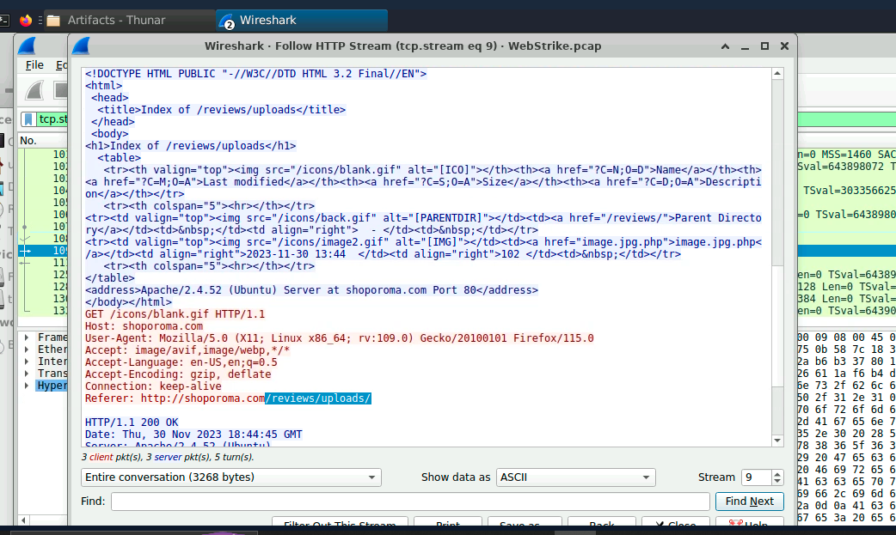
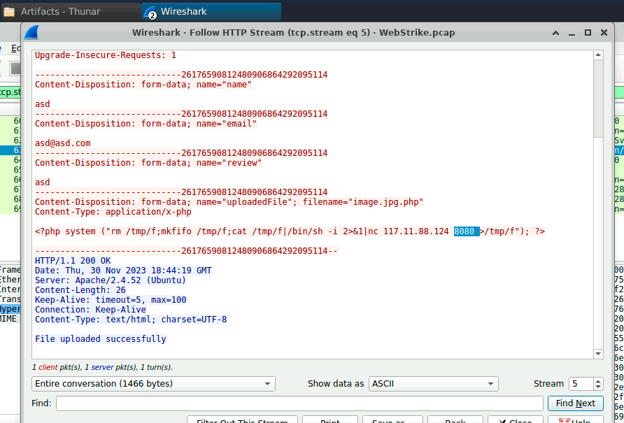
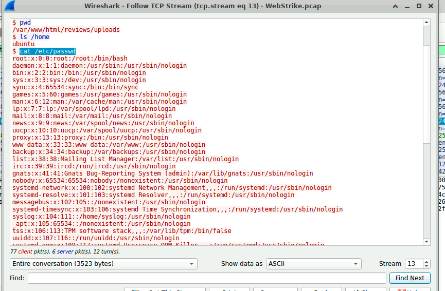

# WebStrike-Lab  
As a SOC Analyst in training, I wanted to strengthen my network forensics and incident response skills.  
This lab helped me practice:
- Investigating suspicious activity using PCAP data.
- Identifying attacker infrastructure (IP, port, user-agent).
- Detecting malicious file uploads and reverse shell communications.
- Understanding data exfiltration attempts and their impact.
- Documenting findings with clear, actionable reports.

Completing this lab gave me hands-on experience with real-world attack scenarios and prepared me for Tier 1 SOC responsibilities.

**SOC Analyst Tier 1 Lab** — Analyze network traffic using Wireshark to investigate a web server compromise, identify web shell deployment, reverse shell communication, and data exfiltration.

**CTF Cyberdefender Link:** https://cyberdefenders.org/blueteam-ctf-challenges/webstrike/

### Category:
**Network Forensics**  

### Tactics:
**Initial Access, Execution, Persistence, Command & Control, Exfiltration**  

### Tool:
**Wireshark**

## Scenario
A suspicious file was identified on a company web server, raising alarms within the intranet. The Development team flagged the anomaly, suspecting potential malicious activity. To address the issue, the network team captured critical network traffic and prepared a PCAP file for review.  
Your task is to analyze the provided PCAP file to uncover how the file appeared and determine the extent of any unauthorized activity.

## Investigation Questions and How I Approached Them

### 1. From which city did the attack originate?
**Reason:** Identifying the geographical origin of the attack facilitates the implementation of geo-blocking measures and the analysis of threat intelligence.

**Solution:**  
- Opened the provided PCAP file and analyzed the source IP address of the attack traffic.  
- Found the attacker’s IP address: `117.11.88.124`.  
- Used [https://www.iplocation.net/ip-lookup](https://www.iplocation.net/ip-lookup) for IP look-up.  
- Results showed the geographical origin to be **Tianjin, China**.

**Proof:**  

### 2. What is the attacker’s full User-Agent?
**Reason:** Knowing the attacker's User-Agent assists in creating robust filtering rules.

**Solution:**  
- Analyzed HTTP traffic in Wireshark and focused on POST requests used for file uploads.  
- Right-clicked a POST request packet → Selected **Follow → HTTP Stream**.  
- Examined the request headers and located the User-Agent string.

**Answer:**  
`User-Agent: Mozilla/5.0 (X11; Linux x86_64; rv:109.0) Gecko/20100101 Firefox/115.0`

**Proof:**  

---

### 3. What is the name of the malicious web shell that was successfully uploaded?
**Reason:** Determining the malicious file name helps locate and remove it from the web server.

**Solution:**  
- On the HTTP Stream page of the POST request, searched for `Content-Disposition`.  
- Found the filename that was uploaded.

**Answer:**  
`image.jpg.php`

**Proof:**  

### 4. Which directory is used by the website to store uploaded files?
**Reason:** Identifying the storage directory allows security teams to remove malicious files and secure the vulnerable endpoint.

**Solution:**  
- Applied filter `http.request.method == "GET"` in Wireshark to isolate GET requests.  
- Followed HTTP streams and inspected for responses with `200 OK`.  
- Discovered the directory path where the uploaded file was stored.

**Answer:**  
`/reviews/uploads/`

**Proof:**  

### 5. Which port, opened on the attacker’s machine, was targeted by the malicious web shell for establishing unauthorized outbound communication?
**Reason:** Knowing the attacker's listening port helps recreate and understand the C2 channel.

**Solution:**  
- Inspected the payload of the uploaded web shell by reviewing the HTTP Stream.  
- Found the reverse shell code specifying the attacker’s port.

**Answer:**  
`8080`

**Proof:**  

### 6. Which file was the attacker attempting to exfiltrate?
**Reason:** Recognizing compromised data helps prioritize incident response actions and measure impact.

**Solution:**  
To determine which file the attacker was attempting to exfiltrate, i followed these steps:
- Knowing the attackers ip address and port, i used `ip.addr == 117.11.88.124 && tcp.port == 8080` filter which captures any packets to/from the attacker on port 8080
- Identified a packet in that flow that has data, and opened the TCP Stream
- Looked for evidence of the commands and found `cat /etc/passwd` 
- this command shows that the attacker was trying to exfiltrate the passwd file.

**Answer:**  
`passwd`

**Proof:**  

## Summary & Next Steps
- **Root Cause:** Web server allowed file upload without proper filtering, enabling remote code execution.  
- **Impact:** Attacker successfully uploaded a PHP web shell, executed commands, and attempted data exfiltration.  
- **Recommendations:**  
  - Implement server-side file validation (MIME type, extension, size).  
  - Disable execution permissions on upload directories.  
  - Deploy a WAF (Web Application Firewall) to detect suspicious requests.  
  - Monitor outbound traffic for abnormal connections to untrusted IPs.  
  - Patch and harden the web application.

This report provides a clear chain of events from initial compromise to attempted data theft, backed by screenshots for verification.
